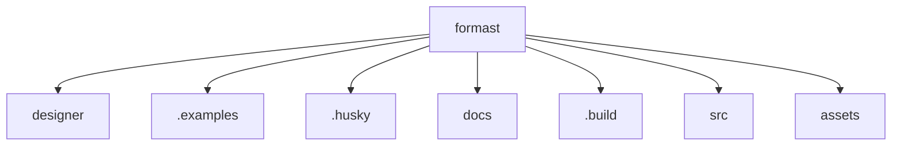

# 基础信息

|      |      |
|------|------|
| 名称 | formast |
| 编码语言 | .java |
| 代码路径 | formast |
| 概述说明 | None |

# 说明

None

### 包内部结构视图

该流程图展示了`formast`目录下的子目录和文件结构。`formast`作为根节点，包含了`designer`、`.examples`、`.husky`、`docs`、`.build`、`src`和`assets`等子节点。每个子节点均直接隶属于`formast`，没有进一步的层级嵌套，清晰地反映了项目的目录布局。

# 文件列表 File List

| 名称   | 类型  | 说明 |
|-------|------|-------------|

